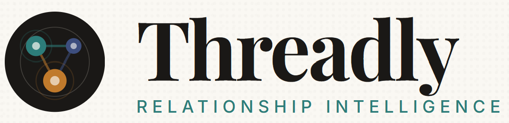

# Threadly



**A Chief and a Crew of AI specialists that keep every relationship you've ever made alive, warm, and queryable.**

Threadly is a relationship intelligence platform built on a shared graph architecture. Your entire team—or entire portfolio—works from one queryable network of contacts, interactions, and warmth signals, without losing privacy or breaking the walls between entities.

---

## 🎯 What is Threadly?

Five AI specialists manage every relationship in the background. One Chief answers questions across the whole graph.

- **Chief** - Master Connect: Ask your relationship graph anything in plain English
- **Snap** - Business cards → enriched contacts in seconds
- **Nudge** - Secret cues trigger perfectly-timed follow-ups
- **Gatekeeper** - Inbound screening + qualification
- **Pulse** - DMs from Instagram, X, Telegram in real time
- **Recall** - Voice notes → structured memory + follow-ups

### Three Tiers

| Tier | Use Case | Scale |
|------|----------|-------|
| **Solo** | Individual operators, creators, founders | One voice, one graph |
| **Teams** | Founders, BD, IR, community leads | Shared team graph, 4-20 people |
| **Enterprise** | VCs, family offices, holding companies | Portfolio networks, strict entity walls |

---

## ✨ Features

### Solo Tier
- Six AI Crew members trained on your voice
- Every contact across Telegram, WhatsApp, Gmail, LinkedIn in one graph
- 10-minute Morning Connect daily ritual
- Per-contact autonomy (auto-send, approve, or never-auto-draft)

### Teams Tier
- One shared graph every teammate contributes to
- Coordinated outreach (Crew knows who's already touched a contact)
- Duplicate-touch alerts before sends
- SSO, SCIM provisioning, audit logs

### Enterprise Tier
- Portfolio company independence + fund-level visibility
- Two-gate governance (fund approval + contact owner approval)
- Aggregate metadata only (walls ARE the feature)
- Custom DPAs, data residency, compliance-ready architecture

---

## 🏗️ Tech Stack

- **Framework:** [Next.js](https://nextjs.org/) 16.2.9 (Turbopack)
- **Language:** TypeScript 5
- **Styling:** Tailwind CSS 4 with PostCSS
- **UI Icons:** Lucide React 1.18.0
- **Database:** (Backend integration ready)
- **Deployment:** Vercel-ready

---

## 🚀 Getting Started

### Prerequisites
- Node.js 18+
- npm or yarn

### Installation

```bash
# Clone the repository
git clone <repo-url>
cd threadly

# Install dependencies
npm install

# Install required utilities
npm install clsx tailwind-merge
```

### Development

```bash
# Start dev server
npm run dev

# Open http://localhost:3000
```

### Build & Deploy

```bash
# Build for production
npm run build

# Start production server
npm start
```

**Vercel Deployment:**
- Root Directory: `./` (default)
- Build Command: Auto-detected
- Output Directory: `.next` (auto-detected)
- No custom configuration needed

---

## 📁 Project Structure

```
threadly/
├── public/
│   ├── brand/
│   │   ├── favicon.png          # Favicon (dark)
│   │   ├── faviconc.png         # Favicon (color)
│   │   ├── logobg.png           # Logo (background)
│   │   ├── logoblack.png        # Logo (black)
│   │   ├── logocolor.png        # Logo (color)
│   │   └── logowhite.png        # Logo (white)
│   └── [other assets]
├── src/
│   ├── app/
│   │   ├── page.tsx             # Homepage
│   │   ├── enterprise/          # Enterprise tier marketing
│   │   ├── teams/               # Teams tier marketing
│   │   ├── layout.tsx           # Root layout
│   │   └── globals.css          # Global styles + theme
│   ├── components/              # React components
│   │   ├── crew-hero.tsx        # Crew character cards
│   │   ├── crew-grid.tsx        # 6-tile Crew layout
│   │   ├── cue-branching.tsx    # Signal detection demo
│   │   ├── master-connect-landing.tsx
│   │   ├── home-loader.tsx      # Loading splash
│   │   └── [other components]
│   └── lib/
│       ├── utils.ts             # Tailwind utilities
│       └── fixtures.ts          # Demo data
├── package.json
├── tsconfig.json
├── next.config.ts
└── README.md
```

---

## 🎨 Design System

**Brand Colors:**
- Indigo (Chief) - `#3d4e7e`
- Coral (Snap) - `#e85a3c`
- Teal (Nudge) - `#2d7d7a`
- Copper (Gatekeeper) - `#c07a2c`
- Indigo (Pulse) - `#3d4e7e`
- Sage (Recall) - `#7b9a8d`

**Typography:**
- Editorial: Brand-forward serif font
- Mono: System monospace for UI labels

**Spacing:** 8px base unit (Tailwind)

---

## 🔐 Compliance & Privacy

- **PDPA** - Singapore compliant ✓
- **GDPR** - EU compliant ✓
- **SOC 2 Type II** - On roadmap (H2 2026)
- **Data Residency** - Configurable per entity ✓
- **Custom DPAs** - Per legal relationship ✓
- **SSO/SAML/OIDC** - Identity provider ready ✓
- **SCIM Provisioning** - Auto onboard/offboard ✓
- **Audit Log** - Every action, every entity ✓

**Privacy Principle:**
> Classification is local. The graph is the user's. Every action is human-approved or user-authorised. No training on user data, ever.

---

## 📊 Demo Data

The codebase includes fixture data for:
- Ecosystem summaries (fund-level ROI tracking)
- Portfolio verticals (5 sample verticals)
- Portfolio companies (14 sample companies)
- Team members & shared graph visualization
- Query examples & use cases

See `src/lib/fixtures.ts` for sample data structure.

---

## 🤝 Contributing

This is an internal project. For changes:
1. Branch from `main`
2. Make changes
3. Test locally (`npm run build`)
4. Push and create PR

---

## 📝 License

Proprietary. All rights reserved.

---

## 🎯 Roadmap

- [ ] SOC 2 Type II certification (H2 2026)
- [ ] Live API integrations (Telegram, WhatsApp, Gmail)
- [ ] Advanced warmth scoring algorithms
- [ ] Custom Crew member training
- [ ] Webhook support for external systems
- [ ] Mobile app (iOS/Android)

---

**Made with ❤️ by the Threadly team.**
